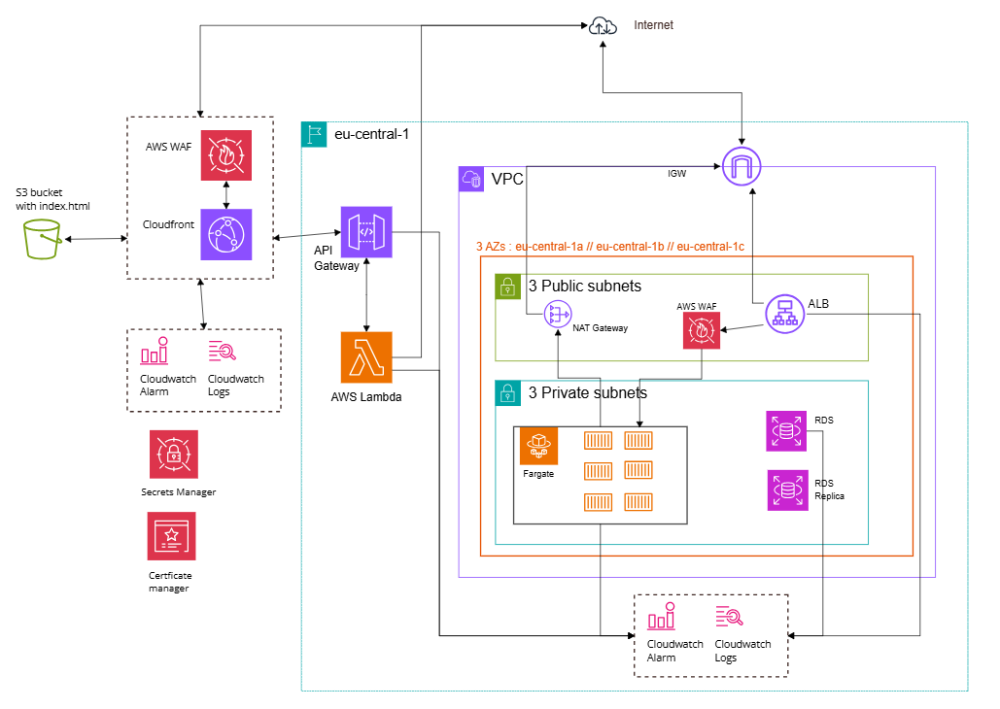

# Full Trip Design Infrastructure

## Notes :
- Frontend infrastructure is featured with S3 + CloudFront.
- The whole point behind the connection between Cloudfront -> PrivateLink -> VPCE -> NLB was to avoid having to buy a domain for the TLS Certificate
 - Cloudfront will not be able to connect to a HTTP endpoint, only HTTPS due to CORS and web browser security policies.
 - By introducing : Cloudfront -> PrivateLink -> VPCE -> NLB -> Fargate, this is a workaround avoid having ALB + Route53 + TLS Certificate. But there is a hassle around having a SG restricting Ingress traffic from CloudFront IPs to the VPCE.

> But after consideration :
> Simpler = public ALB + HTTPS + CloudFront, then lock down access via security groups and certs. Much less hassle, easier maintenance.